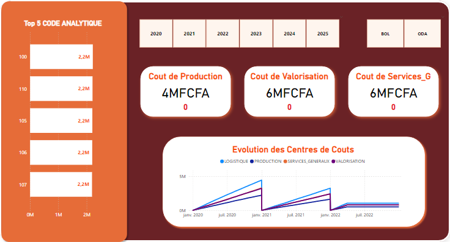
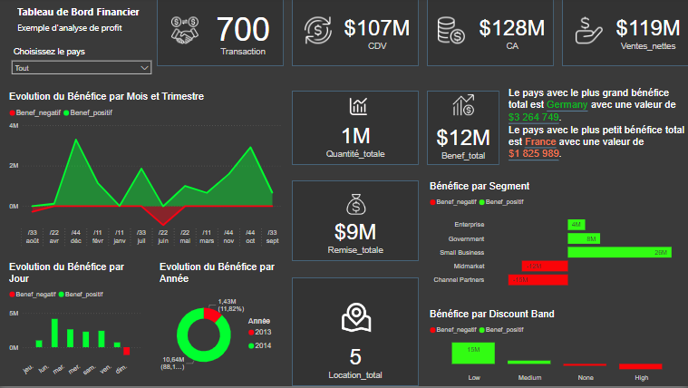
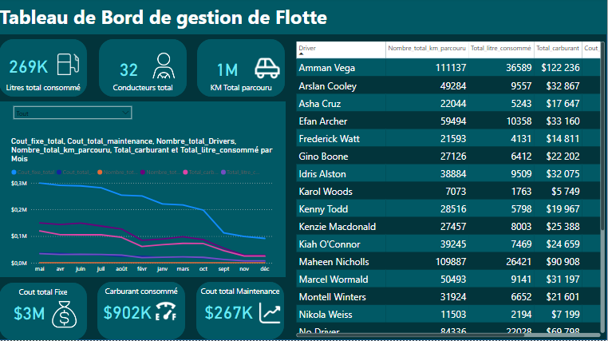
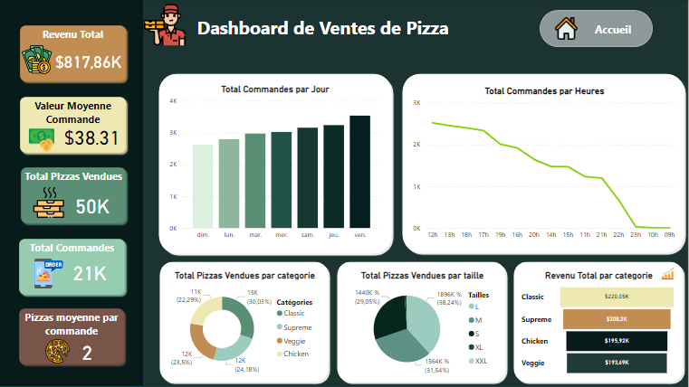
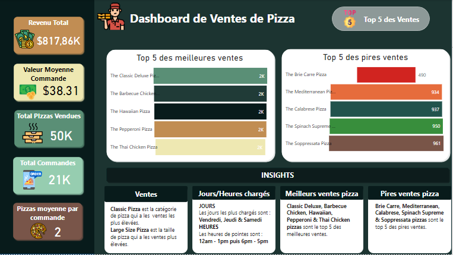
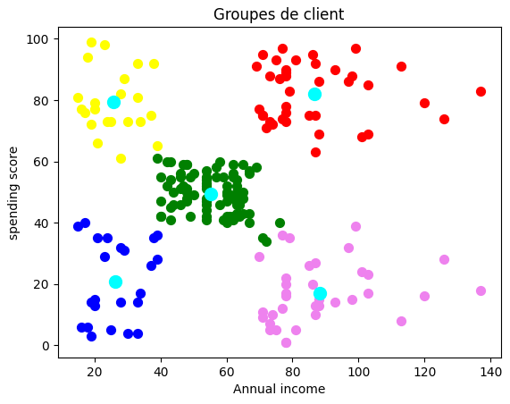
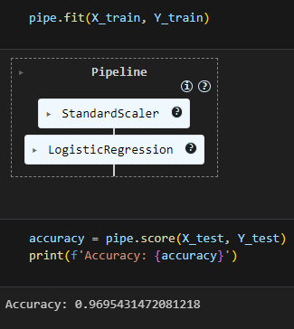

# Bienvenue sur mon Portfolio Data Analyse 📊

## À propos de moi 👋

Je suis **MAFFO FRANS FLORIS**, analyste de données en devenir. Diplômée en conception et développement de réseaux internet, j'ai débuté dans le développement logiciel avant de me passionner pour l'analyse de données. Forte d'une solide base technique, je me réoriente avec détermination vers un secteur où ma curiosité, ma rigueur et mes compétences analytiques transformeront les données en leviers stratégiques pour l'entreprise. En pleine reconversion professionnelle, je me consacre à des projets concrets pour maîtriser les outils et techniques de l'analyse de données.

Mon objectif : rejoindre une entreprise innovante où je pourrai développer mes compétences, contribuer à des projets ambitieux qui amélioreront la prise de décision et optimiseront les processus.

## Compétences 🛠️

*   **Visualisation de données :** Power BI, Python (Matplotlib, Seaborn)
*   **Programmation :** Python (Pandas, NumPy, Scikit-learn), SQL
*   **Machine Learning :** Classification (Régression Logistique, Détection de fraude), Clustering (K-Means), Prétraitement des données (StandardScaler), Évaluation de modèles (Accuracy_score)
*   **Bases de données :** SQL Server, MySQL, SQLite

## Projets Power BI 📈

### Projet 1 : Analyse de la Comptabilité Générale 🏢

Ce rapport Power BI a été créé pour analyser la structure des coûts d'une entreprise, identifier les principaux centres de coûts et suivre leur évolution au fil du temps.

*   **Objectif :** Identifier les postes de dépenses les plus importants, suivre l'évolution des coûts par centre de coûts et optimiser les dépenses de l'entreprise.
*   **Sources de données :** Données de comptabilité générale, incluant les centres de coûts (production, valorisation, logistique, services généraux), les filiales, les années et les codes analytiques (achat de marchandises, matières premières, fournitures, maintenance, etc.).
*   **Visualisations clés :**
    *   Tableau de bord interactif permettant de filtrer les données par filiale et par année.
    *   Les différents coûts.
    *   Top 5 des codes analytiques les plus importants en termes de coûts.
    *   Courbe d'évolution des coûts par centre de coûts au fil des années.
*   **Insights :**
    *   Les coûts de Centre de Coût Logistique sont particulièrement élevés dans la filiale Filiale BOL.
    *   Le Code Analytique 110 a la somme de valeurs la plus élévée qui est de 2216780 au cours des trois dernières années.
*   **Actions recommandées :**
    *   Négocier de meilleurs tarifs avec les fournisseurs pour les codes analytiques les plus coûteux.
    *   Mettre en place un plan d'optimisation des coûts pour les centres de coûts dont les dépenses augmentent de manière significative.
    *   Réaliser un audit des dépenses de maintenance pour identifier les gaspillages et les inefficacités.

[Lien vers le dépôt GitHub](https://github.com/fransfloris/portfolio/tree/my-pages/Rapport_cg1)
[Lien vers la version interactive (si Power BI Embedded ou outil tiers)]

### Projet 2 : Analyse Financière et Commerciale des Ventes 📊

Ce rapport Power BI a été conçu pour analyser l'historique des ventes de produits en fonction de différentes dimensions (catégories, pays, segments) et analyser le profit.

*   **Objectif :** Comprendre les performances commerciales de l'entreprise, identifier les produits et les segments les plus rentables, et optimiser les stratégies de vente et de marketing.
*   **Sources de données :** Données de ventes, données de stocks.
*   **Visualisations clés :**
    *   Tableau de bord interactif présentant les principaux indicateurs de performance (KPIs) : le nombre de transactions, les coûts de vente, le chiffre d'affaires, les ventes nettes, les quantités totales, le profit total, les remises totales, etc.
    *   Graphiques d'évolution du bénéfice par Mois et par Trimestre, par jour et par Année.
    *   Analyse du bénéfice par segment et par rabais.
*   **Insights :**
    *   Le segment Small Business est le plus rentable en termes de profit.
    *   Le pays avec le plus grand bénéfice total est Germany avec une valeur de $3 264 749.
    *   Le pays avec le plus petit bénéfice total est France avec une valeur de $1 825 989.
    *   Le bénéfice a un pourcentage de croissance de 88,18% à l'année 2014.
    *   Les remises importantes ont un impact négatif sur la marge bénéficiaire.
*   **Actions recommandées :**
    *   Concentrer les efforts de vente et de marketing sur le segment Small Business.
    *   Optimiser la politique de remises pour maximiser le profit sans sacrifier les volumes de vente.

[Lien vers le dépôt GitHub](https://github.com/fransfloris/portfolio/tree/my-pages/Rapport_financier)
[Lien vers la version interactive (si Power BI Embedded ou outil tiers)]

### Projet 3 : Analyse de la Gestion de Flotte 🚚

Ce rapport Power BI a été créé pour suivre et optimiser la gestion de la flotte de véhicules d'une entreprise, en analysant les coûts, la consommation de carburant et la maintenance.

*   **Objectif :** Réduire les coûts de gestion de la flotte, optimiser la consommation de carburant, améliorer la maintenance des véhicules et assurer la sécurité des conducteurs.
*   **Sources de données :** Données de gestion de flotte, incluant les données des clients, les véhicules, les conducteurs, etc.
*   **Visualisations clés :**
    *   Tableau de bord présentant les principaux indicateurs de performance de la flotte (KPIs) : les litres totaux consommés, le nombre de conducteurs, le nombre de kilomètres parcourus, les coûts fixes totaux, le carburant consommé et les coûts totaux de maintenance.
    *   Graphique d'évolution du coût de maintenance par mois.
    *   Tableau recapitulatif des transactions des différents conducteurs.
*   **Insights :**
    *   Le coût par kilomètre est plus élevé pour le conducteur Amman Vega.
    *   La consommation de carburant est plus importante pendant le Mois de Mai.
    *   Certains conducteurs ont des coûts de maintenance significativement plus élevés que les autres.
*   **Actions recommandées :**
    *   Mettre en place un programme de formation à l'éco-conduite pour réduire la consommation de carburant.
    *   Négocier des contrats de maintenance préventive pour réduire les coûts de maintenance corrective.

[Lien vers le dépôt GitHub](https://github.com/fransfloris/portfolio/tree/my-pages/Rapport_logistique)
[Lien vers la version interactive (si Power BI Embedded ou outil tiers)]

### Projet 4 : Analyse des Ventes de Pizzas en Ligne 🍕

Ce rapport Power BI a été conçu pour analyser les données de ventes de pizzas *en ligne* afin d'identifier les produits les plus populaires, d'optimiser l'expérience utilisateur, d'améliorer le marketing numérique et d'augmenter les revenus.

*   **Objectif :** Optimiser le menu en ligne, améliorer la gestion des stocks, optimiser les campagnes de marketing numérique, personnaliser l'expérience client et augmenter les revenus de la plateforme de vente en ligne.
*   **Sources de données :** Données de ventes de pizzas en ligne.
*   **Visualisations clés :**
    *   Tableau de bord présentant les principaux indicateurs de performance de la plateforme de vente en ligne (KPIs) : le revenu total, la valeur moyenne par commande, le total des pizzas vendues, le total de commandes, le nombre moyen de pizzas par commande.
    *   Analyse des ventes par catégorie de pizza (Classic, Supreme, Veggie...) et par taille (S, M, L, XL, XXL).
    *   Analyse des commandes par jour et par heure.
    *   Top 5 des meilleures et des pires ventes de pizzas.
*   **Insights :**
    *   La pizza Classic est la plus vendue en ligne, suivie de la pizza Supreme.
    *   Les ventes en ligne sont plus importantes le Samedi et a l'heure de 12am.
    *   La valeur moyenne par commande est plus élevée lorsque les clients commandent des pizzas de taille L.
*   **Actions recommandées :**
    *   Mettre en avant les pizzas les plus vendues dans le menu en ligne et les promotions.
    *   Personnaliser les offres en fonction des préférences des clients et de leur historique de commandes.
    *   Proposer des offres groupées (pizza + boisson + dessert) pour encourager les clients à commander des pizzas de grande taille.

[Lien vers le dépôt GitHub](https://github.com/fransfloris/portfolio/tree/my-pages/Rapport_vente_pizza)
[Lien vers la version interactive (si Power BI Embedded ou outil tiers)]

## Projets Python 🐍

### Projet 1 : Segmentation de la Clientèle des Centres Commerciaux (Mall Customers) 🛍️

Ce projet Python a été réalisé pour segmenter la clientèle d'un centre commercial en utilisant l'algorithme de clustering K-Means.

*   **Objectif :** Identifier des groupes de clients homogènes afin d'optimiser les stratégies marketing.
*   **Sources de données :** L'ensemble de données "Mall_Customers.csv" contient des informations sur les clients d'un centre commercial, telles que leur identifiant, leur âge, leur sexe, leur revenu annuel et leur score de dépenses.
*   **Algorithmes utilisés :** Clustering K-Means.
*   **Résultats :**
    *   Le clustering K-Means a permis d'identifier 05 segments de clientèle distincts.
    *   Le segment 02 se caractérise par un revenu annuel élevé et un score de dépenses élevé.
    *   Le segment 05 se caractérise par un revenu annuel faible et un score de dépenses faible.
*   **Actions recommandées :**
    *   Adapter les campagnes marketing aux caractéristiques de chaque segment de clientèle.
    *   Proposer des offres personnalisées aux clients à fort potentiel.
    *   Mettre en place des programmes de fidélité pour les clients les plus fidèles.

[Lien vers le dépôt GitHub](https://github.com/fransfloris/portfolio/tree/my-pages/Segmentation_clients)

### Projet 2 : Détection des Fraudes par Carte de Crédit 💳

Ce projet Python a été réalisé pour détecter les transactions frauduleuses par carte de crédit en utilisant des techniques de machine learning.

*   **Objectif :** Identifier les transactions frauduleuses afin de protéger les clients et de minimiser les pertes financières.
*   **Sources de données :** L'ensemble de données contient des transactions anonymisées effectuées par carte de crédit en septembre 2013. Les caractéristiques (V1-V28) sont le résultat d'une transformation PCA. Les caractéristiques 'Time' et 'Amount' sont également incluses. La variable cible 'Class' indique si la transaction est frauduleuse (1) ou non (0).
*   **Algorithmes utilisés :** Régression Logistique, précédé d'une étape de standardisation des données.
*   **Résultats :**
    *   Nous avons obtenu 284315 transactions legales et 492 transactions frauduleuses sur les données de test.
    *   La segmentation du jeu de données en transactions legales et frauduleuses puis l'extraction de 492 transactions parmi les transactions legales pour constituer au mieux les données à entraîner.
    *   Le modèle Pipe a une précision de 0.9695431472081218 pour la détection des fraudes.
*   **Actions recommandées :**
    *   Implémenter le modèle de détection de fraude en temps réel.
    *   Enquêter sur les transactions signalées comme suspectes.
    *   Surveiller les performances du modèle et le ré-entraîner si nécessaire.

[Lien vers le dépôt GitHub](https://github.com/fransfloris/portfolio/tree/my-pages/Detection_fraude)

## Contactez-moi 📧

*   [Mon Email](mailto:fransfloris58@gmail.com)
*   [Mon LinkedIn](www.linkedin.com/in/frans-floris)
*   [Mon GitHub](https://github.com/fransfloris)

---

© 2025 MAFFO FRANS FLORIS
